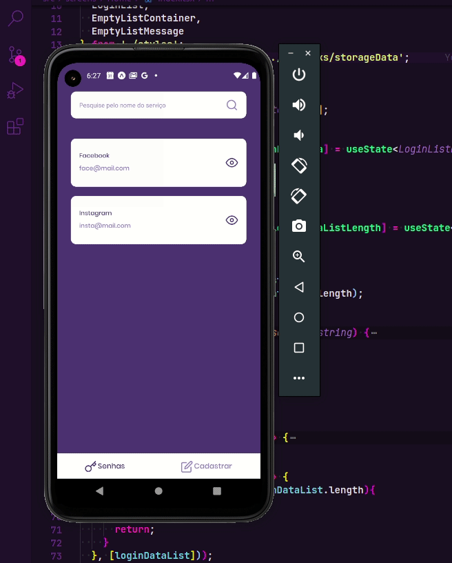

<html>
<head>
    
</head>
<body>

# <spam>Passmanager</spam>
It's a cross-platform mobile application biult with react-native.

## Installation

First you need to download this repository (or make a clone).
After that, you should <b>install</b> the necessary dependencies with a single command:

> 
 yarn install 

or
> 
 npm install 

## About

<b>passmanager</b> it's a cross-platform mobile app built with react-native for saving passwords and logins in order to make the user's life easier.

> 

    Below, a gif that shows the app working:

</body>
</html5>
